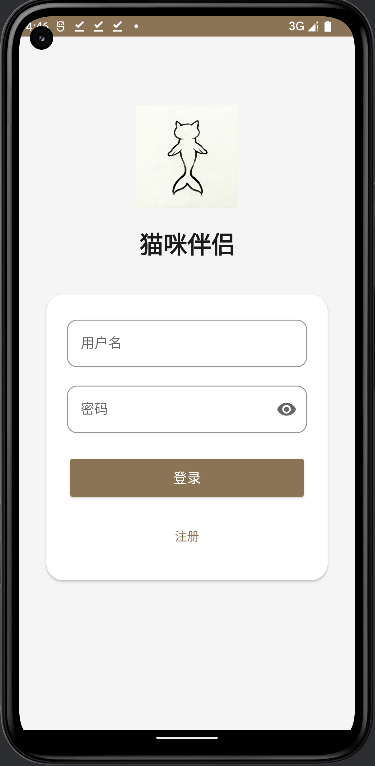
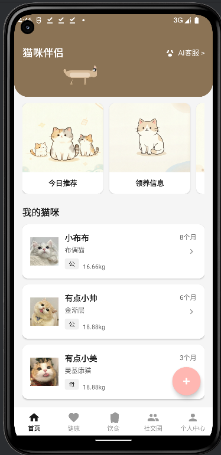
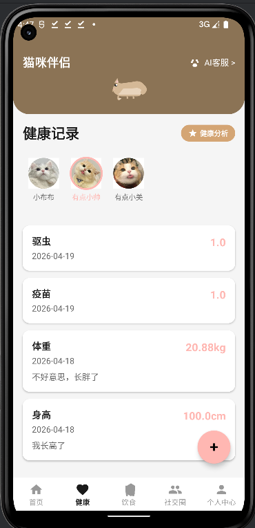
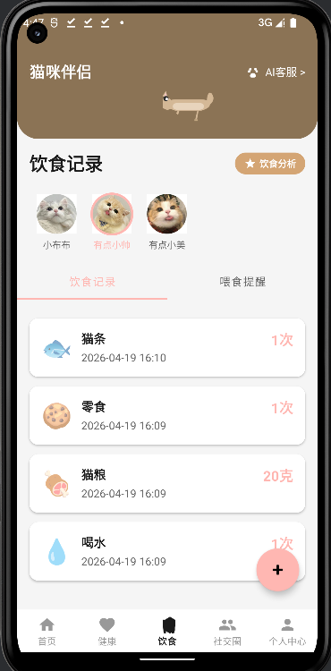
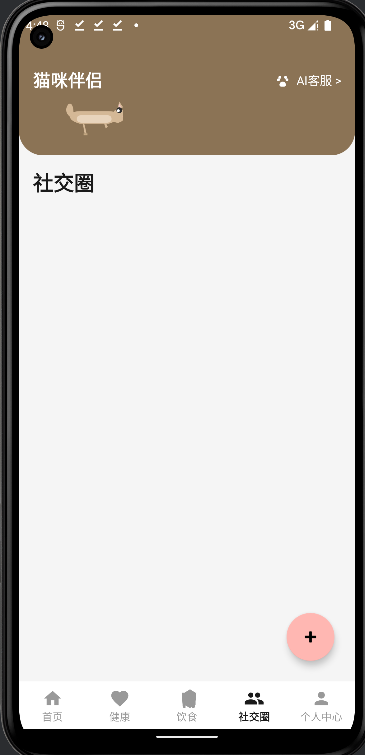
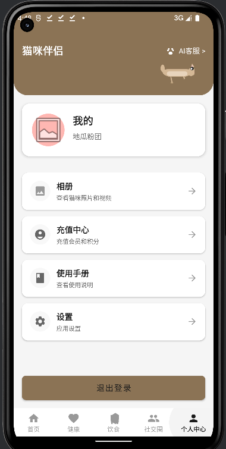
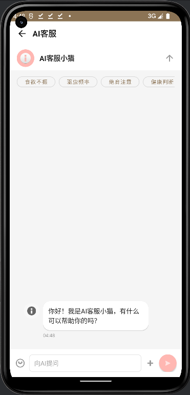

# 猫咪伴侣 App（全栈开发）

一个简约清新的猫咪管理应用，支持猫咪档案管理、健康饮食记录、AI智能分析与喂食提醒。

## 功能模块

### ✅ 已完成

**客户端功能：**
- 用户登录注册（手机验证码 + JWT认证）
- 猫咪档案管理（添加、编辑、删除、头像上传）
- 健康记录管理（体重/身高/疫苗/驱虫，支持时间筛选）
- 饮食记录管理（猫粮/喝水/零食/猫条，支持时间筛选）
- 喂食提醒功能（精确闹钟 + 推送通知）
- AI健康/饮食分析报告（Canvas绑图生成精美卡片）
- 猫咪切换选择器（左右滑动圆形头像）

**服务端功能：**
- RESTful API（Express + JWT认证）
- 用户认证（注册、登录、Token刷新）
- 猫咪 CRUD（云端同步）
- 健康/饮食记录 CRUD
- 阿里云 OSS 文件上传（头像、媒体）
- 智谱AI集成（健康建议、饮食分析）

### 🔄 待完善

- 相册上传功能
- 社交圈发布功能
- AI识别猫咪说话
- AI管家聊天

## 技术栈

### 客户端
Kotlin + MVVM + ViewBinding + Retrofit + OkHttp + Glide + Room + Coroutines + LiveData + Canvas绑图 + 阿里云OSS + 智谱AI

### 服务端
Node.js + Express + MySQL + JWT + 阿里云OSS + 智谱AI + Multer + Winston日志

## 项目结构

```
├── app/                           # Android 客户端
│   └── src/main/java/com/cat_together/meta/
│       ├── CatTogetherApp.kt      # Application类
│       ├── database/              # Room 数据库
│       │   ├── AppDatabase.kt
│       │   └── dao/               # Data Access Object
│       ├── model/                 # 数据模型
│       ├── network/               # Retrofit 网络层
│       │   ├── RetrofitClient.kt
│       │   └── RetrofitService.kt
│       ├── ui/                    # UI层
│       │   ├── main/              # 主Activity + Fragment
│       │   ├── splash/            # 启动页
│       │   ├── login/            # 登录注册
│       │   ├── home/             # 首页
│       │   ├── cat/              # 猫咪档案
│       │   ├── health/           # 健康记录
│       │   ├── diet/             # 饮食记录
│       │   ├── album/            # 相册
│       │   ├── social/           # 社交圈
│       │   └── report/           # 报告预览
│       └── utils/                 # 工具类
│           ├── ReportGenerator.kt # AI报告绑图
│           └── ReminderScheduler.kt # 闹钟调度

└── server/                        # Node.js 服务端
    └── src/
        ├── controllers/           # 控制器
        ├── middleware/            # 中间件（认证、上传）
        ├── routes/                # 路由
        ├── utils/                 # 工具（OSS、日志）
        └── app.js                 # 应用入口
```

## 运行项目

### 客户端

1. 使用 Android Studio 打开项目
2. 等待 Gradle 同步完成
3. 配置后端地址：`app/build.gradle` 中 `BASE_URL`
4. 运行到模拟器或真机

### 服务端

```bash
cd server
npm install
cp .env.example .env  # 配置数据库和OSS密钥
npm run dev          # 开发模式
npm start            # 生产模式
```

## 配置说明

### 环境变量（服务端）

```env
# 数据库
DB_HOST=localhost
DB_PORT=3306
DB_USER=root
DB_PASSWORD=你的密码
DB_NAME=cat_together

# 阿里云OSS
OSS_ACCESS_KEY_ID=你的AccessKey
OSS_ACCESS_KEY_SECRET=你的AccessKeySecret
OSS_BUCKET=你的Bucket
OSS_REGION=oss-cn-hangzhou

# 智谱AI
ZHIPU_API_KEY=你的APIKey
```

### 后端API地址（客户端）

在 `app/build.gradle` 的 `debug` buildType 中配置：
```gradle
buildConfigField "String", "BASE_URL", "\"http://你的服务器IP:3000/api\""
```

## AI 报告功能

健康/饮食分析报告使用 Canvas 绑图生成，包含：
- 猫咪基本信息（名字、品种）
- 数据统计（体重变化、饮食次数）
- AI 智能建议（智谱AI生成）
- 可下载保存到相册

## UI 设计

### 配色方案
- 主色：#FFB7B2（温柔粉色）
- 辅助色：#B5EAD7（薄荷绿）
- 强调色：#FFDAC1（蜜桃橘）
- 背景色：#FAF9F6（米白色）
- 文字色：#2D3436（深灰）

### 设计风格
- 圆角卡片
- 简约布局
- Material Design 组件
- 顶部猫咪动画

## 下一步开发计划

1. 完成相册上传功能
2. 实现社交圈发布功能
3. 接入 AI 猫咪说话识别
4. 开发 AI 管家聊天功能

## Demo 截图

| 登录页 | 首页 |
|:---:|:---:|
|  |  |

| 健康记录页 | 饮食记录页 |
|:---:|:---:|
|  |  |

| 社交圈页 | 个人中心页 |
|:---:|:---:|
|  |  |

| AI客服页 |  |
|:---:|:---:|
|  |  |